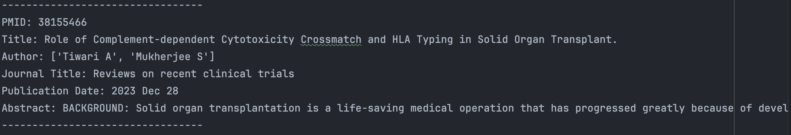
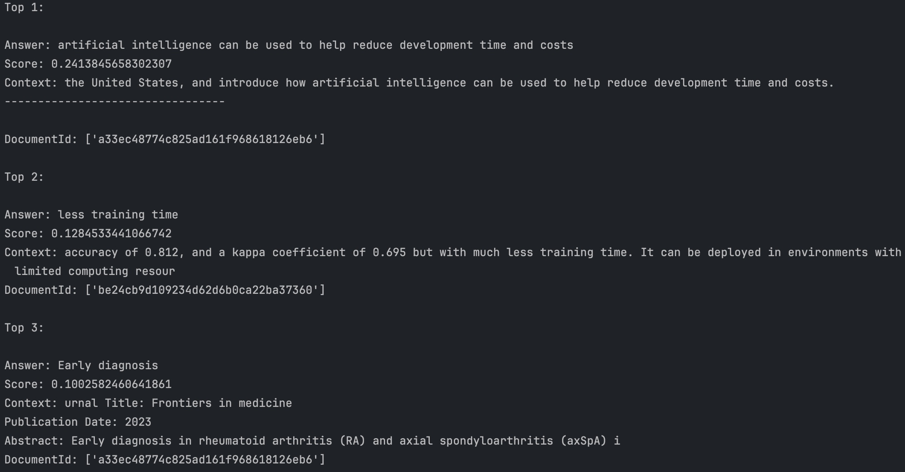

# QA-Robot-Med-INLPT-WS2023
Question Answering (QA) system tailored for the medical domain on <em>Intelligence</em>

# GitHub Name Mapping 
- CoreSheep - Li Jiufeng,
- Aayushtirmalle - Aayush Tirmalle,
- Swathi1110 - Swathi Thiruppathi Kannan
- Alagu17 - Alagumeena Thiruppathi Kannan

## Table of Contents

- [Dataset](#dataset)
- [Pipeline](#pipeline)

## Dataset

- Dataset description
    - data source: [pubmed](https://pubmed.ncbi.nlm.nih.gov/)
    - data format:
      - PMID
      - Title
      - Author
      - Journal Title
      - Publication Date
      - Abstract
    - data size: there are 20 articles in a txt file, so we have 20 * 50 = 1000 articles.
- Example


- Download

```bash
# run the script /data_process/load_data.py to download more data
pip install Bio
python /data_process/load_data.py
```

## Pipeline
This pipeline is based on [haystack](https://github.com/deepset-ai/haystack), which is an opensource nlp framework.
- Initializing document store
```python
# Initializing the OpensearchDocumentStore
document_store = OpenSearchDocumentStore()
```

- Indexing the documents with a data preprocessing pipeline
```python
# Indexing Documents with a Pipeline
doc_dir = "../assets/data/pubmed_medical_intelligence"

# Initialize the pipeline, TextConverter, and PreProcessor
indexing_pipeline = Pipeline()
text_converter = TextConverter()
preprocessor = PreProcessor(
    clean_whitespace=True,
    clean_header_footer=True,
    clean_empty_lines=True,
    split_by="word",
    split_length=200,
    split_overlap=20,
    split_respect_sentence_boundary=True,
)

# Add the nodes into an indexing pipeline.
indexing_pipeline.add_node(component=text_converter, name="TextConverter", inputs=["File"])
indexing_pipeline.add_node(component=preprocessor, name="PreProcessor", inputs=["TextConverter"])
indexing_pipeline.add_node(component=document_store, name="DocumentStore", inputs=["PreProcessor"])
```

- Initializing the Retriever
```python
retriever = BM25Retriever(document_store=document_store)
```

- Initializing the Reader
```python
reader = FARMReader(model_name_or_path="deepset/roberta-base-squad2", use_gpu=False)
```

- Creating  query pipeline
```python
querying_pipeline = ExtractiveQAPipeline(reader, retriever)
query = "How does artificial intelligence contribute to reducing drug development time in USA?"
result = querying_pipeline.run(query=query, params={"Retriever": {"top_k": 3}, "Reader": {"top_k": 3}})
```

- Answering



# References
[Haystack Documentation](https://haystack.deepset.ai/)
[Streamlit Documentation](https://docs.streamlit.io/)
[Langchain Documentation](https://python.langchain.com/docs/get_started/introduction)


